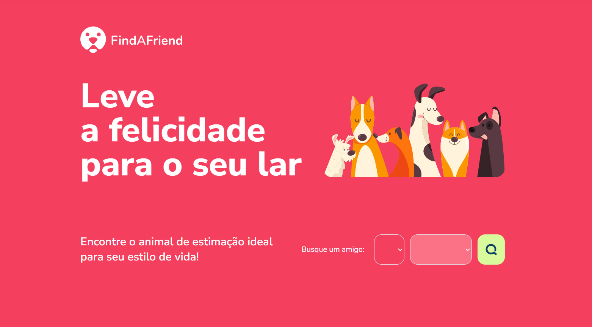

# Find a Friend - Encontre Seu Novo Amigo 🐾

**Find a Friend** é um web app criado para conectar pessoas a animais que precisam de um lar. A plataforma facilita o processo de adoção, ajudando a dar uma nova chance a cães, gatos e outros pets em busca de amor e cuidado.

## 🚧 Status do Projeto
Atualmente, a versão **web estática** está em desenvolvimento. A aplicação já conta com:
- **Roteamento Estático:** Navegação entre páginas utilizando JavaScript.
- **Tailwind CSS:** Estilização moderna e responsiva para uma interface atrativa.
- **Estrutura Estática:** Conteúdo básico para demonstrar a funcionalidade inicial.

## 🛠️ Tecnologias Utilizadas
- **HTML5**: Estruturação semântica do conteúdo.  
- **CSS3** (com Tailwind CSS): Estilização responsiva e modular.  
- **JavaScript:** Lógica para roteamento e interatividade básica.  

## 🔧 Próximos Passos
- Integração com APIs para buscar informações de animais disponíveis para adoção.  
- Implementação de funcionalidades dinâmicas, como favoritos e filtros.  
- Melhoria na organização dos componentes e no gerenciamento de estados.